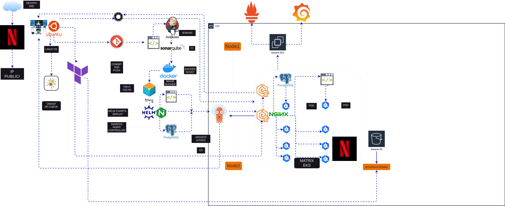

## Deploy Netflix Clone na AWS usando Terraform, Postgresql,Grafana, Prometheus, Helm, Sonarqube, Trivy, OWASP, Jenkins, Argocd+GitOps - DevSecOps!

<div align="center">
  <a href="http://netflix-clone-with-tmdb-using-react-mui.vercel.app/">
    
  </a>
</div>

<div align="center">
  
</div>


<br />

## Fase 1: Configuração Inicial, Implantação e Deploy do Terraform para criar as instâncias e o cluster EKS na AWS

```sh
cd terraform
```

```sh
terraform init
```

```sh
terraform plan
```

```sh
terraform apply
```

"OBS: Assim que todo o projeto for finalizado, você pode rodar o comando `terraform destroy` para destruir toda a infraestrutura provisionada na AWS."

```sh
terraform destroy
```
###  Etapa 1: Crie um Bucket S3 através da console da AWS para armazenar o arquivo terraform.tfstate

<div align="center">
  
</div>


### Etapa 2: Acesse as VM EC2

- Conecte-se à instância usando o acesso SSH.
- Faça atualização dos packages

## EC2 Instances
<div align="center">
  
</div>

## VPC Network
<div align="center">
  
</div>

## DB-Postgresql
"OBS: O banco de dados (relacional) PostgreSQL foi provisionado via Terraform em uma instância EC2, que está configurada em uma sub-rede privada usando um NAT Gateway. Dessa forma, garantimos que não haverá nenhum tipo de acesso externo, assegurando a segurança dos nossos dados."

### Etapa 3: clonar o código:

- Atualize todos os pacotes e clone o código.

- Clone o repositório de código do seu aplicativo na instância do EC2:

```sh
https://github.com/thdevopssre/aws-deploy-jenkins
```

## Step 3: Kubernetes

### Acesse o Cluster EKS 
Nesta fase, iremos acessar o cluster Kubernetes com 2 grupos de nós via terminal. Isso fornecerá uma melhor interação com o cluster em um ambiente escalável para implantar e gerenciar seus aplicativos.

```sh
aws eks update-kubeconfig --region <> --name <cluster_name>
```

<div align="center">
  
</div>

## Nodegroup
<div align="center">
  
</div>


### Etapa 3: instale o Docker e execute o aplicativo usando um contêiner:

- Configure o Docker na instância EC2:

```sh
sudo apt-get update
sudo apt-get install docker.io -y
sudo usermod -aG docker $USER  # Replace with your system's username, e.g., 'ubuntu'
newgrp docker
sudo chmod 777 /var/run/docker.sock
```

- Faça o build e execute seu aplicativo usando contêineres Docker:

```sh
docker build -t netflix .
docker run -d --name netflix -p 8081:80 netflix:<TAG>

# delete
docker stop <containerid>
docker rmi -f netflix
```
Ele mostrará um erro porque você precisa da chave API

### Etapa 4: Obtenha a chave API:

- Abra um navegador da web e navegue até o site TMDB (The Movie Database).
- Clique em “Login” e crie uma conta.
- Uma vez logado, vá ao seu perfil e selecione “Configurações”.
- Clique em “API” no painel esquerdo.
- Crie uma nova chave API clicando em “Criar” e aceitando os termos e condições.
- Forneça os detalhes básicos necessários e clique em “Enviar”.
- Você receberá sua chave API TMDB.

Agora recrie a imagem do Docker com sua chave de API:
```sh
docker build --build-arg TMDB_V3_API_KEY=<your-api-key> -t netflix .
```
<div align="center">
  
</div>

## Fase 2: Segurança

1.Instale SonarQube e Trivy:

- Instale SonarQube e Trivy na instância EC2 para verificar vulnerabilidades.


2.Integre SonarQube e configure:

- Integre o SonarQube a sua pipeline de CI/CD.
- Configure o SonarQube para analisar o código em busca de problemas de qualidade e segurança.
sonarqube
```sh
docker run -d --name sonar -p 9000:9000 sonarqube:lts-community
```
publicIP:9000 (por padrão, nome de usuário e senha são admin)

<div align="center">
  
</div>
Acessar:


Para instalar o Trivy:
```sh
sudo apt-get install wget apt-transport-https gnupg lsb-release
wget -qO - https://aquasecurity.github.io/trivy-repo/deb/public.key | sudo apt-key add -
echo deb https://aquasecurity.github.io/trivy-repo/deb $(lsb_release -sc) main | sudo tee -a /etc/apt/sources.list.d/trivy.list
sudo apt-get update
sudo apt-get install trivy        
```
para fazer o escaner da imagem usando trivy
```sh
trivy image <imageid>
```
<div align="center">
  
</div>
## Fase 3: CI/CD Setup

1. Instale o Jenkins para automação:

- Instale o Jenkins na instância EC2 para automatizar a implantação: Instale o Java
```sh
sudo apt update
sudo apt install fontconfig openjdk-17-jre
java -version
openjdk version "17.0.8" 2023-07-18
OpenJDK Runtime Environment (build 17.0.8+7-Debian-1deb12u1)
OpenJDK 64-Bit Server VM (build 17.0.8+7-Debian-1deb12u1, mixed mode, sharing)

#jenkins
sudo wget -O /usr/share/keyrings/jenkins-keyring.asc \
https://pkg.jenkins.io/debian-stable/jenkins.io-2023.key
echo deb [signed-by=/usr/share/keyrings/jenkins-keyring.asc] \
https://pkg.jenkins.io/debian-stable binary/ | sudo tee \
/etc/apt/sources.list.d/jenkins.list > /dev/null
sudo apt-get update
sudo apt-get install jenkins
sudo systemctl start jenkins
sudo systemctl enable jenkins
```
- Acesse o Jenkins em um navegador da web usando o IP público da sua instância EC2.

IP público: 8080

**2. Instale os plug-ins necessários no Jenkins:**
Goto Manage Jenkins →Plugins → Available Plugins →

Instale os plug-ins abaixo

1 Eclipse Temurin Installer
2 SonarQube Scanner
3 NodeJs Plugin
4 email Extension Plugin

### Configure Java and Nodejs in Global Tool Configuration
Goto Manage Jenkins → Tools → Install JDK(17) and NodeJs(16)→ Click on Apply and Save

Depois de adicionar token de sonar

Clique em Aplicar e Salvar

A opção Configurar Sistema é usada no Jenkins para configurar diferentes servidores

A configuração global da ferramenta é usada para configurar diferentes ferramentas que instalamos usando plug-ins

Instalaremos um scanner sonar nas ferramentas.

Crie um webhook Jenkins

1. Configure CI/CD Pipeline no Jenkins:
```sh
pipeline {
    agent any
    tools {
        jdk 'jdk17'
        nodejs 'node16'
    }
    environment {
        SCANNER_HOME = tool 'sonar-scanner'
    }
    stages {
        stage('clean workspace') {
            steps {
                cleanWs()
            }
        }
        stage('Checkout from Git') {
            steps {
                git branch: 'main', url: 'https://github.com/thdevopssre/aws-deploy-jenkins.git'
            }
        }
        stage("Sonarqube Analysis") {
            steps {
                withSonarQubeEnv('sonar-server') {
                    sh '''$SCANNER_HOME/bin/sonar-scanner -Dsonar.projectName=Netflix \
                    -Dsonar.projectKey=Netflix'''
                }
            }
        }
        stage("quality gate") {
            steps {
                script {
                    waitForQualityGate abortPipeline: false, credentialsId: 'Sonar-token'
                }
            }
        }
        stage('Install Dependencies') {
            steps {
                sh "npm install"
            }
        }
    }
}
```
Certamente, aqui estão as instruções sem números de etapas:

Instale as ferramentas Dependency-Check e Docker no Jenkins

Instale o plug-in de verificação de dependência:

- Vá para "Dashboard" na interface web do Jenkins.
- Navegue até “Gerenciar Jenkins” → “Gerenciar plug-ins”.
- Clique na guia “Disponível” e pesquise “OWASP Dependency-Check”.
- Marque a caixa de seleção "OWASP Dependency-Check" e clique no botão "Instalar sem reiniciar".

### Configure Dependency-Check Tool:

- Depois de instalar o plugin Dependency-Check, você precisa configurar a ferramenta.
- Vá para "Dashboard" → "Manage Jenkins" → "Global Tool Configuration".
- Encontre a seção "Verificação de dependência do OWASP".
- Adicione o nome da ferramenta, por exemplo, “DP-Check”.
- Salve suas configurações.

### Instale ferramentas Docker e plug-ins Docker:

- Vá para "Dashboard" na interface web do Jenkins.
- Navegue até “Manage Jenkins” → “Manage Plugins”.
Clique na guia “Available” e pesquise “Docker”.
- Verifique os seguintes plug-ins relacionados ao Docker:
    - Docker
    - Docker Commons
    - Docker Pipeline
    - Docker API
    - docker-build-step
- Clique no botão “Instalar sem reiniciar” para instalar esses plug-ins.

### Add DockerHub Credentials:
- Para lidar com credenciais do DockerHub com segurança em seu pipeline Jenkins, siga estas etapas:
    -Vá para “Dashboard” →"Manage Jenkins" → "Manage Credentials."
    - Clique em “System” e depois em "Global credentials (unrestricted)."
    - Clique em “Add Credentials" no lado esquerdo.
    - Escolha "Secret-text" como tipo de credenciais.
    - Insira suas credenciais do DockerHub (Username and Password) e forneça um ID às credenciais (por exemplo, "docker").
    - Clique em “OK” para salvar suas credenciais do DockerHub.

Agora, você instalou o plugin Dependency-Check, configurou a ferramenta e adicionou plugins relacionados ao Docker junto com suas credenciais do DockerHub no Jenkins. Agora você pode prosseguir com a configuração do pipeline do Jenkins para incluir essas ferramentas e credenciais em seu processo de CI/CD.

```sh
pipeline{
    agent any
    tools{
        jdk 'jdk17'
        nodejs 'node16'
    }
    environment {
        SCANNER_HOME=tool 'sonar-scanner'
    }
    stages {
        stage('clean workspace'){
            steps{
                cleanWs()
            }
        }
        stage('Checkout from Git'){
            steps{
                git branch: 'main', url: 'https://github.com/thdevopssre/aws-deploy-jenkins.git'
            }
        }
        stage("Sonarqube Analysis "){
            steps{
                withSonarQubeEnv('sonar-server') {
                    sh ''' $SCANNER_HOME/bin/sonar-scanner -Dsonar.projectName=Netflix \
                    -Dsonar.projectKey=Netflix '''
                }
            }
        }
        stage("quality gate"){
           steps {
                script {
                    waitForQualityGate abortPipeline: false, credentialsId: 'Sonar-token' 
                }
            } 
        }
        stage('Install Dependencies') {
            steps {
                sh "npm install"
            }
        }
        stage('OWASP FS SCAN') {
            steps {
                dependencyCheck additionalArguments: '--scan ./ --disableYarnAudit --disableNodeAudit', odcInstallation: 'DP-Check'
                dependencyCheckPublisher pattern: '**/dependency-check-report.xml'
            }
        }
        stage('TRIVY FS SCAN') {
            steps {
                sh "trivy fs . > trivyfs.txt"
            }
        }
        stage("Docker Build & Push"){
            steps{
                script{
                   withDockerRegistry(credentialsId: 'docker', toolName: 'docker'){   
                       sh "docker build --build-arg TMDB_V3_API_KEY=<yourapikey> -t netflix ."
                       sh "docker tag netflix thsre/netflix:<TAG> "
                       sh "docker push thsre/netflix:<TAG> "
                    }
                }
            }
        }
        stage("TRIVY"){
            steps{
                sh "trivy image thsre/netflix:<TAG> > trivyimage.txt" 
            }
        }
        stage('Deploy to container'){
            steps{
                sh 'docker run -d --name netflix -p 8081:80 thsre/netflix:<TAG>'
            }
        }
    }
}

Se você receber um erro de falha no login do docker

sudo su
sudo usermod -aG docker jenkins
sudo systemctl restart jenkins
```
## Outputs + Stage View
<div align="center">
  
</div>

<div align="center">
  
</div>

## Fase 4: Monitoramento

1.Instale o Prometheus e o Grafana:

Configure o Prometheus e o Grafana para monitorar seu aplicativo.

Instalando o Prometheus:

Primeiro, crie um usuário Linux dedicado para o Prometheus e baixe o Prometheus:
```sh
sudo useradd --system --no-create-home --shell /bin/false prometheus
wget https://github.com/prometheus/prometheus/releases/download/v2.47.1/prometheus-2.47.1.linux-amd64.tar.gz
```
Extraia arquivos do Prometheus, mova-os e crie diretórios:

```sh
tar -xvf prometheus-2.47.1.linux-amd64.tar.gz
cd prometheus-2.47.1.linux-amd64/
sudo mkdir -p /data /etc/prometheus
sudo mv prometheus promtool /usr/local/bin/
sudo mv consoles/ console_libraries/ /etc/prometheus/
sudo mv prometheus.yml /etc/prometheus/prometheus.yml
```
Defina o dono dos diretórios:

```sh
sudo chown -R prometheus:prometheus /etc/prometheus/ /data/
```

Crie um arquivo de configuração da unidade systemd para o Prometheus:
```sh
sudo nano /etc/systemd/system/prometheus.service
```

Adicione o seguinte conteúdo ao arquivo `prometheus.service`:

```yaml
[Unit]
Description=Prometheus
Wants=network-online.target
After=network-online.target

StartLimitIntervalSec=500
StartLimitBurst=5

[Service]
User=prometheus
Group=prometheus
Type=simple
Restart=on-failure
RestartSec=5s
ExecStart=/usr/local/bin/prometheus \
  --config.file=/etc/prometheus/prometheus.yml \
  --storage.tsdb.path=/data \
  --web.console.templates=/etc/prometheus/consoles \
  --web.console.libraries=/etc/prometheus/console_libraries \
  --web.listen-address=0.0.0.0:9090 \
  --web.enable-lifecycle

[Install]
WantedBy=multi-user.target
```
Aqui está uma breve explicação das partes principais deste arquivo `prometheus.service`:

- `User` e `Group` especificam o usuário e grupo do Linux sob o qual o Prometheus será executado.
-` ExecStart` é onde você especifica o caminho binário do Prometheus, o local do arquivo de configuração `(prometheus.yml`), o diretório de armazenamento e outras configurações.
- `web.listen-address` configura o Prometheus para escutar em todas as interfaces de rede na porta 9090.
- `web.enable-lifecycle` permite o gerenciamento do Prometheus por meio de chamadas de API.

Habilite e inicie o Prometheus:
```sh
sudo systemctl enable prometheus
sudo systemctl start prometheus
```
Verifique o status do Prometheus:
```sh
sudo systemctl status prometheus
```
Você pode acessar o Prometheus em um navegador web usando o IP do seu servidor e a porta 9090:

`http://<your-server-ip>:9090`


### Installing Node Exporter:

Crie um usuário de sistema para o Node Exporter e baixe o Node Exporter:
```sh
sudo useradd --system --no-create-home --shell /bin/false node_exporter
wget https://github.com/prometheus/node_exporter/releases/download/v1.6.1/node_exporter-1.6.1.linux-amd64.tar.gz
```
Extraia os arquivos do Node Exporter, mova o binário e limpe:
```sh
tar -xvf node_exporter-1.6.1.linux-amd64.tar.gz
sudo mv node_exporter-1.6.1.linux-amd64/node_exporter /usr/local/bin/
rm -rf node_exporter*
```
Crie um arquivo de configuração da unidade systemd para o Node Exporter:

```sh
sudo vim /etc/systemd/system/node_exporter.service
```

Adicione o seguinte conteúdo ao arquivo` node_exporter.service`:

```yaml
[Unit]
Description=Node Exporter
Wants=network-online.target
After=network-online.target

StartLimitIntervalSec=500
StartLimitBurst=5

[Service]
User=node_exporter
Group=node_exporter
Type=simple
Restart=on-failure
RestartSec=5s
ExecStart=/usr/local/bin/node_exporter --collector.logind

[Install]
WantedBy=multi-user.target
```

Substitua` --collector.logind` por quaisquer sinalizadores adicionais conforme necessário.

Habilite e inicie o Node Exporter:
```sh
sudo systemctl enable node_exporter
sudo systemctl start node_exporter
```
Verifique o status do Node Exporter:
```sh
sudo systemctl status node_exporter
```
Você pode acessar as métricas do Node Exporter no Prometheus.

**2.Configure Prometheus Plugin Integration:**

Integrate Jenkins with Prometheus to monitor the CI/CD pipeline.

Prometheus Configuration:

To configure Prometheus to scrape metrics from Node Exporter and Jenkins, you need to modify the` prometheus.yml` file. Here is an example `prometheus.yml` configuration for your setup:

```sh
global:
  scrape_interval: 15s

scrape_configs:
  - job_name: 'node_exporter'
    static_configs:
      - targets: ['localhost:9100']

  - job_name: 'jenkins'
    metrics_path: '/prometheus'
    static_configs:
      - targets: ['<your-jenkins-ip>:<your-jenkins-port>']
```

Certifique-se de substituir `<your-jenkins-ip>` e `<your-jenkins-port>` pelos valores apropriados para sua configuração do Jenkins.

Verifique a validade do arquivo de configuração:
```sh
promtool check config /etc/prometheus/prometheus.yml
```

Recarregue a configuração do Prometheus sem reiniciar:
```sh
curl -X POST http://localhost:9090/-/reload
```
Você pode acessar os targets do Prometheus em:

`http://<your-prometheus-ip>:9090/targets`

## Metrcis Jenkins and Node Exporte EKS
<div align="center">
  
</div>
### Grafana

Instale o Grafana no Ubuntu 22.04 e configure-o para funcionar com o Prometheus

**Etapa 1: instalar dependências:**

Primeiro, certifique-se de que todas as dependências necessárias estejam instaladas:

```sh
sudo apt-get update
sudo apt-get install -y apt-transport-https software-properties-common
```

**Step 2: Adicione a GPG Key:**
```sh
wget -q -O - https://packages.grafana.com/gpg.key | sudo apt-key add -
```

**Step 3: Adicione o repositório do Grafana:**
```sh
echo "deb https://packages.grafana.com/oss/deb stable main" | sudo tee -a /etc/apt/sources.list.d/grafana.list
```
**Step 4: Atualize e Instale o Grafana:**
```sh
sudo apt-get update
sudo apt-get -y install grafana
```
**Step 5: Habilite e inicie o serviço Grafana:**

Para iniciar o Grafana automaticamente após uma reinicialização, habilite o serviço:
```sh
sudo systemctl enable grafana-server
```
Inicie o Grafana:
```sh
sudo systemctl start grafana-server
```
**Step 6: verifique o status do Grafana**
```sh
sudo systemctl status grafana-server
```
**Step 7: Acesse a Interface Web do Grafana**

Abra um navegador da web e navegue até Grafana usando o endereço IP do seu servidor. A porta padrão para Grafana é 3000. Por exemplo:

`http://<seu-ip-do-servidor>:3000`

Você será solicitado a fazer login no Grafana. O nome de usuário padrão é “admin” e a senha padrão também é “admin”.

**Step 8: Troque a senha padrão**
Ao fazer login pela primeira vez, o Grafana solicitará que você altere a senha padrão por motivos de segurança. Siga as instruções para definir uma nova senha.

**Step 9:Adicione o Prometheus Data Source:**

Para visualizar métricas, você precisa adicionar uma fonte de dados. Siga esses passos:

- Clique no ícone de engrenagem (⚙️) na barra lateral esquerda para abrir o menu “Configuration”.

- Selecione "Data Sources".

- Clique no botão "Add data source" button".

- Escolha "Prometheus" como tipo de fonte de dados.

- Na seção "HTTP":

    - Defina o "URL" como `http://localhost:9090` (assumindo que o Prometheus esteja sendo executado no mesmo servidor).
    - Clique no botão "Salvar e testar" para garantir que a fonte de dados esteja funcionando.
  
**Step 10: Importe um Dashboard**

Para facilitar a visualização das métricas, você pode importar um painel pré-configurado. Siga esses passos:

- Clique no ícone “+” (mais) na barra lateral esquerda para abrir o menu “Criar”.

- Selecione “Dashboard”.

- Clique na opção do painel "Import".

- Insira o código do painel que deseja importar (por exemplo, código 1860).

Clique no botão "load".

Selecione a fonte de dados que você adicionou (Prometheus) no menu suspenso.

- Clique no botão "Import".

Agora você deve ter um Dashboard Grafana configurado para visualizar as métricas do Prometheus.

Grafana é uma ferramenta poderosa para criar visualizações e Dashboards e você pode personalizá-lo ainda mais para atender às suas necessidades específicas de monitoramento.

É isso! Você instalou e configurou o Grafana com êxito para trabalhar com o Prometheus para monitoramento e visualização.

## Jenkins metrics
<div align="center">
  
</div>

## Cluster EKS metrcis
<div align="center">
  
</div>

**2.Configure a integração do plug-in Prometheus:**
- Integre Jenkins ao Prometheus para monitorar o pipeline de CI/CD.
**Step 5: Notificação**

1.Implementar serviços de notificação:
  - Configure notificações por email no Jenkins ou outros mecanismos de notificação.


## Monitore o Kubernetes com Prometheus

Prometheus é um poderoso kit de ferramentas de monitoramento e alertas, e você o usará para monitorar seu cluster Kubernetes. Além disso, você instalará o exportador de nós usando o Helm para coletar métricas dos nós do cluster.


## Instale o Node Exporter usando o Helm

To begin monitoring your Kubernetes cluster, you'll install the Prometheus Node Exporter. This component allows you to collect system-level metrics from your cluster nodes. Here are the steps to install the Node Exporter using Helm:

1. Adicione o repositório do Prometheus Community Helm:
```sh
helm repo add prometheus-community https://prometheus-community.github.io/helm-charts
```
2.Crie um namespace Kubernetes para o Node Exporter:
```sh
kubectl create namespace prometheus-node-exporter
```
3.Instale o Node Exporter usando o helm:
```sh
helm install prometheus-node-exporter prometheus-community/prometheus-node-exporter --namespace prometheus-node-exporter
```
Adicione um `Job` ao Scrape Metrics em nodeip:9001/metrics em prometheus.yml:

Atualize sua configuração do Prometheus (`prometheus.yml`) para adicionar um novo `Job` para extrair métricas de` nodeip:9001/metrics`. Você pode fazer isso adicionando a seguinte configuração ao arquivo `prometheus.yml`:

```sh
  - job_name: 'Netflix'
    metrics_path: '/metrics'
    static_configs:
      - targets: ['node1Ip:9100']
```
Substitua 'nome-do-seu-job' por um nome descritivo para o seu job. A seção `static_configs` especifica os `targets` dos quais extrair métricas e, neste caso, é definida como `nodeip:9001`.

Não se esqueça de recarregar ou reiniciar o Prometheus para aplicar essas alterações à sua configuração.

Para implantar um aplicativo com `ArgoCD`, você pode seguir estas etapas, que descreverei no formato Markdown:

## Deploy da Aplicação com ArgoCD

**1.Instale o ArgoCD:**

Todos esses componentes podem ser instalados usando um manifesto fornecido pelo Projeto Argo:
```sh
kubectl create namespace argocd
kubectl apply -n argocd -f https://raw.githubusercontent.com/argoproj/argo-cd/v2.4.7/manifests/install.yaml
```
**2.Expose argocd-server**

```sh
kubectl patch svc argocd-server -n argocd -p '{"spec": {"type": "LoadBalancer"}}'
```
```sh
export ARGOCD_SERVER=`kubectl get svc argocd-server -n argocd -o json | jq --raw-output '.status.loadBalancer.ingress[0].hostname'`
```
**3.Login**
```sh
export ARGOCD_SERVER=`kubectl get svc argocd-server -n argocd -o json | jq --raw-output '.status.loadBalancer.ingress[0].hostname'`
```
**4.Comandos linux para expor a senha e o server do ArgoCD:**

```sh
echo $ARGOCD_SERVER
```
```sh
echo $ARGO_PWD
```
**5. Defina seu repositório GitHub como fonte:**

Depois de instalar o ArgoCD, você precisa configurar seu repositório GitHub como fonte para a implantação do seu aplicativo. Isso normalmente envolve configurar a conexão com o seu repositório e definir a fonte do seu aplicativo ArgoCD. As etapas específicas dependerão de sua configuração e requisitos.

**6. Crie um aplicativo ArgoCD:**
- `name`: Defina o nome do seu aplicativo.
- `destination`: Defina o destino onde seu aplicativo deve ser implantado.
- `project`: Especifique o projeto ao qual o aplicativo pertence.
- `source`: defina a origem do seu aplicativo, incluindo a URL do repositório GitHub, a revisão e o caminho para o aplicativo dentro do repositório.
- `syncPolicy`: Configure a política de sincronização, incluindo sincronização automática, remoção e autocorreção.

<div align="center">
  
</div>

**7.Acesse seu aplicativo**

Para acessar o aplicativo, certifique-se de que a porta `30007` esteja aberta em seu grupo de segurança e, em seguida, abra uma nova aba e cole seu` NodeIP:30007`, seu aplicativo deve estar em execução. 
<div align="center">
  
</div>

## Links úteis para a documentação das tecnologias utilizadas no projeto:
- [AWS](https://aws.amazon.com/)
- [Kubernetes](https://kubernetes.io/pt-br/)
- [Docker Builder Reference](https://docs.docker.com/engine/reference/builder/)
- [Postgres](https://www.postgresql.org/)
- [Acqua Security Tryvi](https://aquasecurity.github.io/trivy/v0.49/)
- [OAWSP](https://owasp.org/site-documentation/)
- [Sonarqube](https://www.sonarsource.com/products/sonarqube/)
- [Helm Docs](https://helm.sh/docs/intro/install/)
- [Terraform AWS Provider Workspace Resource](https://registry.terraform.io/providers/hashicorp/aws/latest/docs/resources/workspaces_workspace)
- [Terraform AWS Getting Started](https://developer.hashicorp.com/terraform/tutorials/aws-get-started/aws-variables)
- [Terraform AWS Resource Tagging Guide](https://registry.terraform.io/providers/hashicorp/aws/latest/docs/guides/resource-tagging)
- [Terraform AWS VPC Module](https://registry.terraform.io/modules/terraform-aws-modules/vpc/aws/2.15.0)
- [Terraform AWS EKS Module](https://registry.terraform.io/modules/terraform-aws-modules/eks/aws/latest)
- [Terraform AWS S3 Bucket Module](https://registry.terraform.io/modules/terraform-aws-modules/s3-bucket/aws/latest)
- [Terraform Configuration Language Guide](https://developer.hashicorp.com/terraform/tutorials/configuration-language/variables)
- [Terraform Language Values and Variables](https://developer.hashicorp.com/terraform/language/values/variables)
- [Kubernetes Nginx Ingress Configuration](https://kubernetes.github.io/ingress-nginx/user-guide/nginx-configuration/)
- [Prometheus](https://prometheus.io/)
- [Grafana](https://grafana.com/)
- [ArgoCD Documentation](https://argo-cd.readthedocs.io/en/stable/)
- [Jenkins CI/CD](https://www.jenkins.io/)
- [PostgreSQL Commands and Language](https://halleyoliv.gitlab.io/pgdocptbr/dml-insert.html)
- [Amazon S3 modules](https://registry.terraform.io/modules/terraform-aws-modules/s3-bucket/aws/latest)
- [AWS update kubeconfig](https://docs.aws.amazon.com/eks/latest/userguide/create-kubeconfig.html)